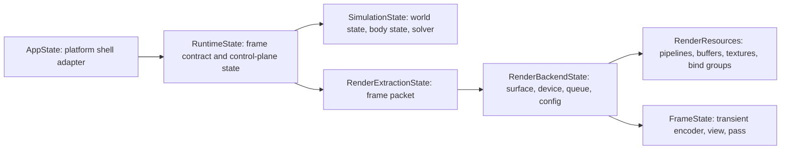

# Anzu Engine Backlog

This backlog is the active plan for a simulation and visualization system.

## Status Baseline
- Implementation status: Not started
- Scope note: Ignore generated legacy implementation details under clanker_code for completion status
- Tracking rule: Every feature below is planned and unchecked

## Personas
- Developer
- Simulation User

## Initiative 1: Runtime and Frame Lifecycle
- [ ] Feature 1.1: Initialize runtime in browser host with stable frame loop
  - Outcome: The browser host starts with a canvas-backed runtime, produces the first frame without a crash, and maintains stable pacing across resize, tab visibility changes, and short suspend/resume events.
  - Scope:
    - In scope: browser canvas bootstrap, wasm-ready app-shell state, explicit redraw pacing, bounded delta handling, fixed-step accumulation with a max-step cap, safe surface reconfiguration, and an explicit acquire -> encode -> submit -> present frame contract.
    - Non-goals: configurable clear color, baseline triangle or texture content changes, gameplay simulation ownership changes, and the full state-decomposition migration from Features 1.8 through 1.12.
  - Constraints and assumptions:
    - The primary acceptance target is the wasm browser host; native behavior must continue to compile.
    - The current render output is considered placeholder continuity and is not the completion metric.
    - The scheduler should use a clamped delta cap of 0.25s to avoid runaway catch-up after tab suspension.
    - The implementation should not introduce full simulation ownership changes yet; it should only add a scheduler seam and a renderer-facing frame entry point.
  - Milestones:
    - M1: Extract shell ownership and introduce runtime readiness state.
    - M2: Introduce runtime pacing and fixed-step scheduling.
    - M3: Move render backend/resource ownership behind a renderer-facing frame path and harden surface lifecycle handling.
  - File-by-file implementation contract:
    - [anzu-engine/src/lib.rs](anzu-engine/src/lib.rs)
      - Action: modify
      - Why: keep this file as the shell adapter and route browser events into the runtime boundary.
      - Structs/enums: `enum AppBootstrapState { Booting, Ready, Failed(String) }`
      - Functions: `fn resumed(&mut self, event_loop: &ActiveEventLoop)`, `fn window_event(...)`, `fn user_event(...)`
      - Ownership notes: App owns shell state only; it should not own frame pacing or GPU backend lifecycle directly.
    - [anzu-engine/src/execution.rs](anzu-engine/src/execution.rs)
      - Action: modify
      - Why: expose the runtime/render modules used by the browser host and keep the execution module as the public boundary.
      - Functions: `pub mod shared`, `pub mod render`
      - Ownership notes: this module is the public execution entry point; it should not contain business logic.
    - [anzu-engine/src/execution/shared.rs](anzu-engine/src/execution/shared.rs)
      - Action: create/modify
      - Why: host the runtime scheduler and timing state so the frame loop is testable independent of the GPU backend.
      - Structs/enums: `struct RuntimeState`, `struct FrameScheduler`, `struct FrameStepPlan`
      - Functions: `fn handle_redraw(&mut self, delta_seconds: f32) -> anyhow::Result<()>`, `fn fixed_update(&mut self)`, `fn resize(&mut self, width: u32, height: u32) -> anyhow::Result<()>`, `fn begin_frame(&mut self, delta_seconds: f32) -> FrameStepPlan`
      - Ownership notes: RuntimeState owns pacing decisions and fixed-step accumulation; it delegates rendering to the backend layer.
    - [anzu-engine/src/execution/render.rs](anzu-engine/src/execution/render.rs)
      - Action: create/modify
      - Why: move surface/device/queue/config and long-lived GPU resources out of the shell and into the renderer-facing layer.
      - Structs/enums: `struct RenderBackendState`, `struct RenderResources`, `enum FrameAcquireOutcome { Ready, Reconfigure, Skipped, Fatal }`
      - Functions: `fn new(window: Arc<Window>) -> anyhow::Result<(RenderBackendState, RenderResources)>`, `fn resize(&mut self, width: u32, height: u32) -> anyhow::Result<()>`, `fn acquire_frame(&mut self) -> anyhow::Result<FrameAcquireOutcome>`, `fn render_frame(&mut self, resources: &RenderResources) -> anyhow::Result<()>`
      - Ownership notes: RenderBackendState owns surface lifecycle and the acquire/encode/submit/present path; RenderResources owns persistent GPU assets.
    - [documents/architecture.md](documents/architecture.md)
      - Action: reference only
      - Why: keep terminology aligned with the runtime/shell/render boundaries while avoiding unrelated documentation churn.
  - Execution flow and ownership boundaries:
    - App owns platform shell concerns only: create window, bootstrap runtime, forward events, and transition readiness state.
    - RuntimeState owns pacing decisions and fixed-step accumulation.
    - RenderBackendState owns surface-state transitions and the frame submission path.
    - RenderResources owns long-lived GPU resources that persist across frames.
    - The renderer-facing frame path should be the only place where acquire/encode/submit/present is executed for this feature.
  - Validation plan:
    - Unit tests for `FrameScheduler::begin_frame` covering zero delta, clamped delta, accumulator carryover, and max-step limiting.
    - Native compile/test pass for the touched runtime module.
    - wasm compile check with `cargo check --target wasm32-unknown-unknown`.
    - Manual browser smoke check for first-frame boot, resize, and suspend/resume stability.
  - Risks and open questions:
    - Risk: redraw ownership can be duplicated if both shell and renderer request redraws. The plan should keep redraw scheduling in the shell/runtime boundary and not in render code.
    - Risk: browser suspend/resume may produce large deltas. The plan should clamp them and limit catch-up steps.
    - Open question resolved by this plan: the feature should use a minimal renderer split now, not a full extraction stack; later features can expand into `RenderExtractionState` and `SimulationState`.
- [ ] Feature 1.2: Clear frame to configurable background color
- [ ] Feature 1.3: Render baseline triangle geometry
- [ ] Feature 1.4: Apply texture to baseline geometry
- [ ] Feature 1.5: Animate baseline transform at fixed timestep
- [ ] Feature 1.6: Handle surface resize, reconfigure, and present lifecycle safely
- [ ] Feature 1.7: Maintain explicit frame contract acquire -> encode -> submit -> present
- [ ] Feature 1.8: Split app shell state from runtime orchestration state
- [ ] Feature 1.9: Split simulation-owned state from render backend state
- [ ] Feature 1.10: Add explicit render extraction state between simulation and renderer
- [ ] Feature 1.11: Keep long-lived render resources separate from per-frame transient state
- [ ] Feature 1.12: Migrate `lib.rs` to platform-shell ownership only (no gameplay mutation ownership)

### Initiative 1 State Decomposition Plan (lib.rs alignment)

### Initiative 1 BDD User Stories

1. Story: Platform shell ownership
Given the runtime starts on native or wasm
When the application initializes
Then `lib.rs` owns platform shell concerns only
And simulation mutation logic is outside app shell state

2. Story: Runtime orchestration boundary
Given a redraw or fixed-step trigger
When frame processing begins
Then `RuntimeState` enforces acquire -> encode -> submit -> present ordering
And stage ownership remains explicit and traceable

3. Story: Simulation ownership boundary
Given simulation ticks execute
When state mutation occurs
Then only `SimulationState` mutates gameplay/world state
And renderer paths consume read-only snapshot data

4. Story: Render extraction contract
Given a stabilized simulation snapshot
When extraction runs
Then `RenderExtractionState` emits a frame packet
And renderer input does not require direct ECS schema coupling

5. Story: Render backend lifecycle safety
Given surface resize, loss, or suboptimal present events
When render backend handles the event
Then `RenderBackendState` reconfigures safely without gameplay-state side effects
And surface lifecycle concerns stay isolated from simulation stages

6. Story: Resource lifecycle separation
Given long-lived pipelines, buffers, and textures
When frame rendering executes
Then `RenderResources` persist across frames
And `FrameState` contains transient per-frame objects only

7. Story: Migration acceptance
Given the state decomposition migration is complete
When reviewers inspect runtime boundaries
Then each state type has a single primary responsibility
And architecture terms match the core glossary in `documents/architecture.md`

## Initiative 2: ECS, Objects, and Extraction Boundaries
- [ ] Feature 2.1: ECS world with stable entity identity and component storage
- [ ] Feature 2.2: ObjectSpec domain with predefined catalog templates
- [ ] Feature 2.3: ObjectRuntime domain with resolved resource handles and lifecycle state
- [ ] Feature 2.4: BodyState and DisplayState split per object
- [ ] Feature 2.5: Light attachments with explicit emitter specs
- [ ] Feature 2.6: Extractor emits frame packet from ECS/object snapshot
- [ ] Feature 2.7: Render consumes frame packet only, without direct ECS schema coupling

## Initiative 3: Physics Foundation
- [ ] Feature 3.1: Canonical BodyState schema with motion, force, and mass properties
- [ ] Feature 3.2: Physics mesh handle on body state
- [ ] Feature 3.3: Collision shape defaults and validation policy
- [ ] Feature 3.4: Inverse mass and inverse inertia construction policy
- [ ] Feature 3.5: Precomputed mass properties from collision geometry at asset-build/load time
- [ ] Feature 3.6: Broadphase plus narrowphase staged collision pipeline
- [ ] Feature 3.7: Deterministic collision event ordering

## Initiative 4: Hybrid Physics Runtime (GPU + CPU Control Plane)
- [ ] Feature 4.1: GPU-resident body state buffers across ticks
- [ ] Feature 4.2: Compute pipeline for integration and interaction solving
- [ ] Feature 4.3: Compact interaction event stream from GPU to CPU
- [ ] Feature 4.4: ECS updates from authoritative simulation outputs
- [ ] Feature 4.5: Dual backend validation path (CPU reference and GPU runtime)
- [ ] Feature 4.6: Physics queue and dispatch orchestration in simulator runtime module

## Initiative 5: Mesh and Asset Strategy
- [ ] Feature 5.1: Dual-mesh model (physics mesh and display mesh)
- [ ] Feature 5.2: Shared physics mesh residency model using shape handles
- [ ] Feature 5.3: Instancing without duplicating shared physics mesh vertices
- [ ] Feature 5.4: Copy-on-change policy for topology mutations (fracture/remesh)
- [ ] Feature 5.5: Unified import pipeline that emits display and physics assets
- [ ] Feature 5.6: Asset handles in ECS instead of embedded vertex blobs

## Initiative 6: Materials, Lights, and Render Composition
- [ ] Feature 6.1: Material registry with data-defined material ids
- [ ] Feature 6.2: Multi-material object rendering via submesh ranges
- [ ] Feature 6.3: Emitter model supporting directional, point, spot, area, environment, and surface emission
- [ ] Feature 6.4: Surface response model separated from emitter records
- [ ] Feature 6.5: Pipeline keying and variant cache
- [ ] Feature 6.6: Composite render passes for emissive and post-process effects
- [ ] Feature 6.7: Low-poly visual strategy support through shading-first enhancement

## Initiative 7: Input and Control Plane
- [ ] Feature 7.1: Profile-owned input vocabularies and mappings
- [ ] Feature 7.2: Engine-owned context routing (gameplay and overlay contexts)
- [ ] Feature 7.3: Escape overlay toggle with deterministic pause behavior
- [ ] Feature 7.4: In-engine diagnostics/performance overlay
- [ ] Feature 7.5: Notification overlay for runtime/control-plane events
- [ ] Feature 7.6: Pause, single-step, and replay workflow for deterministic debugging

## Initiative 8: Simulation Domain Profiles
- [ ] Feature 8.1: Domain-profile registration model (games as one profile)
- [ ] Feature 8.2: Platformer profile bootstrap and acceptance scene
- [ ] Feature 8.3: Isometric 3D profile bootstrap and acceptance scene
- [ ] Feature 8.4: Multi-profile runtime switching in one session

## Initiative 9: Performance, Determinism, and Quality Gates
- [ ] Feature 9.1: Frame boundary instrumentation and health counters
- [ ] Feature 9.2: Deterministic replay regression suite
- [ ] Feature 9.3: Upload budget and pipeline-switch telemetry
- [ ] Feature 9.4: Startup-to-first-frame budget checks
- [ ] Feature 9.5: Warning-free CI gate for runtime-critical modules
- [ ] Feature 9.6: Unified benchmark output for simulation and extraction phases

## Initiative 10: Asset Streaming and Residency Management
- [ ] Feature 10.1: Asset class taxonomy (critical, scaled_optional, reused, streaming)
- [ ] Feature 10.2: Residency state machine (queued, loading, resident, eviction pending, evicted)
- [ ] Feature 10.3: Streaming queues with bounded per-frame upload budgets
- [ ] Feature 10.4: Budget-aware quality fallback before correctness-impacting eviction
- [ ] Feature 10.5: Residency and eviction observability per asset class

## Initiative 11: Platform Topology and ROM/Module Boundaries
- [ ] Feature 11.1: Host/guest service contract (input, render extraction, audio events, storage, lifecycle)
- [ ] Feature 11.2: Runtime loader path with compatibility and integrity checks
- [ ] Feature 11.3: Hash-addressed content cache and activation rollback safety
- [ ] Feature 11.4: Namespace isolation for persisted profile data

## Initiative 12: Networking and Session Features
- [ ] Feature 12.1: Session lifecycle (join, leave, active participants)
- [ ] Feature 12.2: Authoritative shared-state sync baseline
- [ ] Feature 12.3: Client interpolation for remote state smoothing
- [ ] Feature 12.4: Transport abstraction with local loopback and websocket paths
- [ ] Feature 12.5: Transport and synchronization observability

## Initiative 13: Persistence and Serialization
- [ ] Feature 13.1: Local save/load state snapshots
- [ ] Feature 13.2: Snapshot versioning and migration compatibility
- [ ] Feature 13.3: Scene and manifest schema validation
- [ ] Feature 13.4: Deterministic snapshot restore and replay continuity

## Initiative 14: Audio Service
- [ ] Feature 14.1: Core audio service boundary and lifecycle
- [ ] Feature 14.2: Minimal synthesized cue slice (beep/boop)
- [ ] Feature 14.3: Streamed audio asset path
- [ ] Feature 14.4: Spatial audio baseline and attenuation controls
- [ ] Feature 14.5: Audio timing and underrun observability

## Initiative 15: Developer Tooling and Diagnostics
- [ ] Feature 15.1: Build and environment setup automation
- [ ] Feature 15.2: Asset manifest generation and validation tooling
- [ ] Feature 15.3: Runtime regression test harness
- [ ] Feature 15.4: Runtime entity/system inspection overlays
- [ ] Feature 15.5: Structured logging and trace hooks

## Initiative 16: Advanced Animation and Compute Extensions
- [ ] Feature 16.1: Skeletal data ingestion and canonicalization
- [ ] Feature 16.2: GPU skinning baseline render path
- [ ] Feature 16.3: Compute-driven animation inference pipeline
- [ ] Feature 16.4: Multi-character batching and scaling strategy
- [ ] Feature 16.5: Animation debug visualization and parity validation

## Initiative 17: Security and Access Control
- [ ] Feature 17.1: Deny-by-default authorization policy
- [ ] Feature 17.2: Per-request authorization enforcement
- [ ] Feature 17.3: Integrity verification for remotely loaded content
- [ ] Feature 17.4: Auth failure and policy observability

## Priority Bands
- P0: Runtime boundaries, extraction model, physics core, hybrid simulation loop, render/material/light foundations, deterministic quality gates
- P1: Streaming/residency, profile switching, tooling, persistence, audio, platform topology hardening
- P2: Extended networking scale, advanced animation compute features, optional high-complexity effects

## Notes
- This backlog intentionally retains planned feature scope from the prior roadmap where compatible with the simulation-first architecture discussed in this conversation.
- Feature completion history from legacy generated code is not used as progress evidence.
