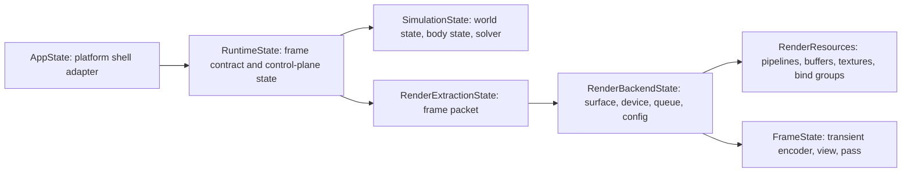

# Anzu Engine Backlog

This backlog is the active plan for a simulation and visualization system.

## Status Baseline
- Implementation status: Not started
- Scope note: Ignore generated legacy implementation details under clanker_code for completion status
- Tracking rule: Every feature below is planned and unchecked

## Personas
- Developer
- Simulation User

## Initiative 1: Runtime and Frame Lifecycle
- [x] Feature 1.1: Initialize runtime in browser host with stable frame loop
  - Outcome: The browser host starts with a canvas-backed runtime, produces the first frame without a crash, and maintains stable pacing across resize, tab visibility changes, and short suspend/resume events.
  - Scope:
    - In scope: browser canvas bootstrap, wasm-ready app-shell state, explicit redraw pacing, bounded delta handling, fixed-step accumulation with a max-step cap, safe surface reconfiguration, and an explicit acquire -> encode -> submit -> present frame contract.
    - Non-goals: configurable clear color, baseline triangle or texture content changes, gameplay simulation ownership changes, and the full state-decomposition migration from Features 1.8 through 1.12.
  - Constraints and assumptions:
    - The primary acceptance target is the wasm browser host; native behavior must continue to compile.
    - The current render output is considered placeholder continuity and is not the completion metric.
    - The scheduler should use a clamped delta cap of 0.25s to avoid runaway catch-up after tab suspension.
    - The implementation should not introduce full simulation ownership changes yet; it should only add a scheduler seam and a renderer-facing frame entry point.
  - Milestones:
    - M1: Extract shell ownership and introduce runtime readiness state.
    - M2: Introduce runtime pacing and fixed-step scheduling.
    - M3: Move render backend/resource ownership behind a renderer-facing frame path and harden surface lifecycle handling.
  - File-by-file implementation contract:
    - [anzu-engine/src/lib.rs](anzu-engine/src/lib.rs)
      - Action: modify
      - Why: keep this file as the shell adapter and route browser events into the runtime boundary.
      - Structs/enums: `enum AppBootstrapState { Booting, Ready, Failed(String) }`
      - Functions: `fn resumed(&mut self, event_loop: &ActiveEventLoop)`, `fn window_event(...)`, `fn user_event(...)`
      - Ownership notes: App owns shell state only; it should not own frame pacing or GPU backend lifecycle directly.
    - [anzu-engine/src/execution.rs](anzu-engine/src/execution.rs)
      - Action: modify
      - Why: expose the runtime/render modules used by the browser host and keep the execution module as the public boundary.
      - Functions: `pub mod shared`, `pub mod render`
      - Ownership notes: this module is the public execution entry point; it should not contain business logic.
    - [anzu-engine/src/execution/shared.rs](anzu-engine/src/execution/shared.rs)
      - Action: create/modify
      - Why: host the runtime scheduler and timing state so the frame loop is testable independent of the GPU backend.
      - Structs/enums: `struct RuntimeState`, `struct FrameScheduler`, `struct FrameStepPlan`
      - Functions: `fn handle_redraw(&mut self, delta_seconds: f32) -> anyhow::Result<()>`, `fn fixed_update(&mut self)`, `fn resize(&mut self, width: u32, height: u32) -> anyhow::Result<()>`, `fn begin_frame(&mut self, delta_seconds: f32) -> FrameStepPlan`
      - Ownership notes: RuntimeState owns pacing decisions and fixed-step accumulation; it delegates rendering to the backend layer.
    - [anzu-engine/src/execution/render.rs](anzu-engine/src/execution/render.rs)
      - Action: create/modify
      - Why: move surface/device/queue/config and long-lived GPU resources out of the shell and into the renderer-facing layer.
      - Structs/enums: `struct RenderBackendState`, `struct RenderResources`, `enum FrameAcquireOutcome { Ready, Reconfigure, Skipped, Fatal }`
      - Functions: `fn new(window: Arc<Window>) -> anyhow::Result<(RenderBackendState, RenderResources)>`, `fn resize(&mut self, width: u32, height: u32) -> anyhow::Result<()>`, `fn acquire_frame(&mut self) -> anyhow::Result<FrameAcquireOutcome>`, `fn render_frame(&mut self, resources: &RenderResources) -> anyhow::Result<()>`
      - Ownership notes: RenderBackendState owns surface lifecycle and the acquire/encode/submit/present path; RenderResources owns persistent GPU assets.
    - [documents/architecture.md](documents/architecture.md)
      - Action: reference only
      - Why: keep terminology aligned with the runtime/shell/render boundaries while avoiding unrelated documentation churn.
  - Execution flow and ownership boundaries:
    - App owns platform shell concerns only: create window, bootstrap runtime, forward events, and transition readiness state.
    - RuntimeState owns pacing decisions and fixed-step accumulation.
    - RenderBackendState owns surface-state transitions and the frame submission path.
    - RenderResources owns long-lived GPU resources that persist across frames.
    - The renderer-facing frame path should be the only place where acquire/encode/submit/present is executed for this feature.
  - Validation plan:
    - Unit tests for `FrameScheduler::begin_frame` covering zero delta, clamped delta, accumulator carryover, and max-step limiting.
    - Native compile/test pass for the touched runtime module.
    - wasm compile check with `cargo check --target wasm32-unknown-unknown`.
    - Manual browser smoke check for first-frame boot, resize, and suspend/resume stability.
  - Risks and open questions:
    - Risk: redraw ownership can be duplicated if both shell and renderer request redraws. The plan should keep redraw scheduling in the shell/runtime boundary and not in render code.
    - Risk: browser suspend/resume may produce large deltas. The plan should clamp them and limit catch-up steps.
    - Open question resolved by this plan: the feature should use a minimal renderer split now, not a full extraction stack; later features can expand into `RenderExtractionState` and `SimulationState`.
- [x] Feature 1.2: Clear frame to configurable background color
  - Outcome: The runtime clears each frame with a configurable background color instead of a hardcoded literal, with ROM-driven runtime updates and explicit validation/error behavior.
  - Scope:
    - In scope: a typed background-color config model, runtime setter path, ROM-issued clear-color updates, render-pass integration using runtime-owned clear state, and unit tests for defaults/validation/update flow.
    - Non-goals: material-system integration, per-entity background effects, post-processing passes, and full ECS extraction ownership migration.
  - Constraints and assumptions:
    - Color representation uses linear RGBA with `f64` channels in [0.0, 1.0] aligned to `wgpu::Color`.
    - Invalid channel input should return an error; this feature does not silently clamp.
    - ROM integration should use `src/roms/texture_demo.rs` as the first profile seam.
    - ROM commands are ROM-local and translated in `lib.rs` before applying to runtime state.
    - Legacy code in `src/abandoned_generated_code/` is guidance-only and not copied as architecture.
    - The clear color source should be runtime/render-state owned and consumed in the frame path, not a shell-local literal.
    - Command application is deterministic: accepted commands apply at next-frame boundary, not immediately mid-frame.
  - Milestones:
    - M1: Introduce clear-color domain types and validation at execution runtime boundary.
    - M2: Wire clear color through frame rendering path and remove hardcoded literal clear.
    - M3: Add ROM-issued runtime update path and tests/manual verification.
  - File-by-file implementation contract:
    - [anzu-engine/src/execution/shared.rs](anzu-engine/src/execution/shared.rs)
      - Action: modify
      - Why: runtime state already owns frame scheduling and is the best near-term seam for frame-level configuration.
      - Structs/enums:
        - `struct BackgroundColor { r: f64, g: f64, b: f64, a: f64 }`
        - `enum BackgroundColorError { ChannelOutOfRange { channel: &'static str, value: f64 } }`
      - Functions/methods:
        - `fn default_background_color() -> BackgroundColor`
        - `fn set_background_color(&mut self, color: BackgroundColor) -> anyhow::Result<()>`
        - `fn background_color(&self) -> BackgroundColor`
      - Ownership notes: `RuntimeState` remains owner of mutable frame-control values exposed to render.
    - [anzu-engine/src/lib.rs](anzu-engine/src/lib.rs)
      - Action: modify
      - Why: current frame clear is hardcoded in shell render path; this must become runtime-driven until later decomposition features migrate rendering ownership.
      - Structs/enums:
        - `enum RomRenderCommand { SetBackgroundColor(BackgroundColor) }` (shell-facing translated command)
        - Update `State` usage to read clear color from runtime-owned state.
      - Functions/methods:
        - `fn render(&mut self) -> Result<(), anyhow::Error>` updated to use runtime clear value.
        - `fn update(&mut self)` routes ROM-local commands through translation and queues at most one pending clear-color update.
      - Ownership notes: app shell reads and applies runtime clear state; it does not own background-color policy.
    - [anzu-engine/src/roms/texture_demo.rs](anzu-engine/src/roms/texture_demo.rs)
      - Action: modify
      - Why: this profile is the requested first ROM seam for background-color control.
      - Structs/enums:
        - `enum TextureDemoRenderCommand { SetBackgroundColor { r: f64, g: f64, b: f64, a: f64 } }`
      - Functions/methods:
        - `fn initial_render_command() -> Option<TextureDemoRenderCommand>`
        - `fn next_render_command(...) -> Option<TextureDemoRenderCommand>` (signature adapted to active runtime hook)
      - Ownership notes: ROM owns scenario intent type; shell translates into runtime-owned validated state.
    - [anzu-engine/src/execution.rs](anzu-engine/src/execution.rs)
      - Action: modify
      - Why: expose background-color runtime types for shell translation and runtime mutation.
      - Functions/modules:
        - Re-export `BackgroundColor` and `BackgroundColorError` from execution boundary.
  - ROM contract (tightened):
    - Command source: ROM-local command type per profile (starting with `TextureDemoRenderCommand`).
    - Translation boundary: `lib.rs` translates ROM-local command payloads into runtime `BackgroundColor` values.
    - Cardinality: ROM emits at most one background-color command per update/frame tick.
    - Scheduling: shell queues at most one pending background-color value and applies it at next-frame boundary before render clear is encoded.
    - Default behavior: if ROM emits no initial command, runtime keeps engine default background color.
    - Validation behavior: runtime rejects invalid channels, keeps previous valid color, and continues frame processing.
    - Determinism rule: multiple same-tick emissions are treated as contract violation in tests; runtime may ignore extras after first.
  - Execution flow and ownership boundaries:
    - ROM emits optional `TextureDemoRenderCommand::SetBackgroundColor` values.
    - Shell translates ROM-local payload into runtime `BackgroundColor` and queues one pending update.
    - Runtime applies queued update at next-frame boundary, validates channel ranges, and stores accepted value in runtime-owned state.
    - Render path reads runtime-owned clear color and maps it into `wgpu::LoadOp::Clear(wgpu::Color { ... })`.
    - If validation fails, runtime returns an error result for the update path and preserves previous valid clear color without aborting frame rendering.
  - Validation plan:
    - Unit tests:
      - default color is deterministic and fully opaque.
      - invalid channels (<0.0 or >1.0) produce `Err` and preserve prior value.
      - valid runtime setter updates are reflected in frame clear state reads.
      - command scheduling applies updates on next frame only.
      - command cardinality enforces at-most-one emission per tick in ROM contract tests.
    - Build checks:
      - `cd /workspaces/Anzu/anzu-engine && cargo test`
      - `cd /workspaces/Anzu/anzu-engine && cargo check --target wasm32-unknown-unknown`
    - Manual browser smoke:
      - verify startup clear color comes from ROM-provided value.
      - trigger at least one runtime color update and verify next frame clear reflects it.
  - Risks and open questions:
    - Risk: in current architecture `lib.rs` still hosts the render pass; later migration features must relocate this path into execution render backend without duplicating clear-color ownership.
    - Risk: if ROM command cadence is per-frame, unnecessary state writes may occur; setter should be idempotent where practical.
    - Open question resolved by this plan: ROM uses ROM-local command types with shell translation, while runtime remains source of truth for validated clear-color state.
- [x] Feature 1.3: Render baseline triangle geometry
  - Outcome: The runtime renders a centered, CCW triangle using engine mesh-provider geometry and a color-only pipeline, with per-vertex color attributes and no texture sampling in the active path.
  - Scope:
    - In scope: consume triangle geometry from `assets::mesh_provider`, keep indexed draw path, introduce baseline color-only shader/pipeline state, and remove active texture loading/bind-group usage from the frame path.
    - Non-goals: texture sampling and UV-driven material behavior (Feature 1.4), full simulation/extraction ownership migration (Features 1.8 through 1.12), and generalized multi-mesh scene composition.
  - Constraints and assumptions:
    - Baseline geometry source is `src/assets/mesh_provider.rs` (`Primitive::Triangle`) instead of hardcoded local geometry constants.
    - Triangle remains fully visible in NDC, centered, and uses CCW winding.
    - Draw contract remains indexed for parity with mesh-provider indices and future shape reuse.
    - Shader is color-only for this feature, but color source is per-vertex attribute (not a hardcoded fragment literal).
    - Baseline per-vertex colors are fixed to: A=`[1.0, 0.5, 0.0, 1.0]` (orange), B=`[0.0, 0.5, 0.5, 1.0]` (teal), C=`[0.29, 0.0, 0.51, 1.0]` (indigo).
    - Winding enforcement for Feature 1.3 tests uses exact index-order validation (`[0, 1, 2]`) instead of signed-area checks.
    - Active shader source of truth for this feature is `src/execution/shaders/shader.wgsl`; duplicate active shader paths are out of scope.
    - Pipeline/resource responsibilities begin moving into `src/execution/render.rs` in this feature, while app-shell/event-loop ownership remains in `src/lib.rs`.
    - Targeted mesh-provider cleanup is allowed only where required by the new baseline triangle contract.
  - Milestones:
    - M1: Establish mesh-provider baseline triangle data path and validation seam.
    - M2: Introduce color-only per-vertex render pipeline in execution render module.
    - M3: Wire shell to execution render path, remove active texture path, and validate wasm/native behavior.
  - File-by-file implementation contract:
    - [anzu-engine/src/assets.rs](anzu-engine/src/assets.rs)
      - Action: modify
      - Why: expose small, testable mesh accessors needed by render-path conversion without spreading geometry assumptions.
      - Structs/enums:
        - `struct Mesh` remains canonical mesh container.
      - Functions/methods:
        - `fn indices(&self) -> Option<&[u16]>` (new helper for read-only indexed draw integration).
      - Ownership notes: `Mesh` remains data-only; it does not own GPU conversion concerns.
    - [anzu-engine/src/assets/mesh_provider.rs](anzu-engine/src/assets/mesh_provider.rs)
      - Action: modify
      - Why: make triangle retrieval explicit and add minimum invariants for baseline rendering.
      - Structs/enums:
        - `enum Primitive` remains unchanged in responsibility.
      - Functions/methods:
        - `fn get_primitive_mesh(primitive: &Primitive) -> Mesh` (existing path retained).
        - `fn triangle_mesh() -> Mesh` (new convenience seam for Feature 1.3 usage).
        - `fn validate_triangle_mesh(mesh: &Mesh) -> anyhow::Result<()>` (new guard for point/index cardinality and bounds).
      - Ownership notes: provider owns static geometry definitions; validation errors are surfaced to render setup.
    - [anzu-engine/src/execution/render.rs](anzu-engine/src/execution/render.rs)
      - Action: modify
      - Why: begin render ownership migration by centralizing baseline triangle GPU resource setup and draw encoding.
      - Structs/enums:
        - `struct BaselineVertex { position: [f32; 3], color: [f32; 4] }`
        - `struct BaselineGeometryGpu { vertex_buffer: wgpu::Buffer, index_buffer: wgpu::Buffer, index_count: u32 }`
        - `struct BaselinePipelineGpu { render_pipeline: wgpu::RenderPipeline }`
        - `struct BaselineTriangleRenderer { geometry: BaselineGeometryGpu, pipeline: BaselinePipelineGpu }`
      - Functions/methods:
        - `fn from_mesh_triangle(mesh: &crate::assets::Mesh) -> anyhow::Result<Vec<BaselineVertex>>`
        - `fn create_baseline_triangle_renderer(device: &wgpu::Device, surface_format: wgpu::TextureFormat) -> anyhow::Result<BaselineTriangleRenderer>`
        - `fn encode_baseline_triangle_pass(renderer: &BaselineTriangleRenderer, encoder: &mut wgpu::CommandEncoder, target: &wgpu::TextureView, clear_color: crate::execution::BackgroundColor)`
      - Ownership notes: execution render module owns pipeline/shader/buffer setup and draw encoding for baseline geometry.
    - [anzu-engine/src/execution/shaders/shader.wgsl](anzu-engine/src/execution/shaders/shader.wgsl)
      - Action: modify
      - Why: convert active shader path to per-vertex color IO and remove texture bindings from baseline pipeline.
      - Functions/modules:
        - `@vertex fn vs_main(...)`
        - `@fragment fn fs_main(...)`
      - Ownership notes: shader contract must match `BaselineVertex` layout exactly.
    - [anzu-engine/src/lib.rs](anzu-engine/src/lib.rs)
      - Action: modify
      - Why: keep shell responsibilities while delegating baseline pipeline/geometry setup and pass encoding into execution render seam.
      - Structs/enums:
        - `State` drops active texture bind-group ownership for this feature.
        - `State` stores `BaselineTriangleRenderer` (from execution render module).
      - Functions/methods:
        - `fn new(...) -> anyhow::Result<Self>` uses `create_baseline_triangle_renderer(...)`.
        - `fn render(&mut self) -> Result<(), anyhow::Error>` calls `encode_baseline_triangle_pass(...)`.
      - Ownership notes: app shell remains orchestrator (window/events/present timing) and does not define triangle GPU setup details.
  - Execution flow and ownership boundaries:
    - `State::new` requests triangle mesh from mesh provider through execution render setup entrypoint.
    - Execution render setup validates mesh cardinality/bounds, converts to `BaselineVertex`, and allocates GPU buffers/pipeline.
    - Per frame, shell resolves runtime background color and delegates draw encoding to `encode_baseline_triangle_pass`.
    - Shell submits and presents; execution render code remains responsible for render-pass draw details.
    - No texture resource creation or bind-group usage occurs on the active 1.3 path.
  - Validation plan:
    - Unit tests:
      - `mesh_provider_triangle_is_centered_and_ccw` validates canonical triangle points and exact index order `[0, 1, 2]`.
      - `mesh_provider_triangle_indices_are_in_bounds` rejects malformed index/cardinality cases.
      - `baseline_vertex_conversion_assigns_expected_colors` verifies deterministic A/B/C color mapping.
      - `baseline_triangle_pipeline_builds_with_color_shader` validates shader/vertex layout compatibility.
      - `baseline_triangle_pass_draws_indexed_triangle` validates indexed draw contract for one triangle.
    - Build checks:
      - `cd /workspaces/Anzu/anzu-engine && cargo test`
      - `cd /workspaces/Anzu/anzu-engine && cargo check --target wasm32-unknown-unknown`
    - Manual browser smoke:
      - verify exactly one centered CCW triangle is visible with per-vertex color interpolation.
      - verify configured background color from Feature 1.2 still applies behind triangle.
      - verify no texture-dependent rendering artifacts remain on the active baseline path.
      - evidence mode: text-only manual observation is sufficient for this feature (no screenshot requirement).
  - Risks and open questions:
    - Risk: partial render migration could duplicate responsibilities between shell and execution render modules if boundaries are not enforced in signatures.
    - Risk: mismatched shader IO vs vertex layout will fail pipeline creation at runtime; tests should cover layout assumptions early.
    - Open question resolved by refinement: use mesh-provider geometry + indexed draw + per-vertex color shader with fixed orange/teal/indigo mapping, execution shader as single active source, and active texture path removed in Feature 1.3.
- [x] Feature 1.4: Apply texture to baseline geometry
  - Outcome: The runtime renders the baseline triangle with ROM-owned texture content and UV mapping while preserving indexed draw, runtime clear-color behavior, and shell-orchestration boundaries.
  - Scope:
    - In scope: ROM-owned texture identifiers and ROM-local asset resolution, UV-enabled baseline geometry contract, textured shader and pipeline path, texture upload and sampler bind-group setup, startup texture selection, and validation for UV and texture contracts.
    - Non-goals: runtime texture switching, engine-owned texture catalogs, multi-material generalization, and model draw-path integration beyond baseline triangle.
  - Constraints and assumptions:
    - Texture assets and texture/model definitions are owned by ROM content under `anzu-engine/src/roms/files`, including `anzu-engine/src/roms/files/textures`.
    - ROM resolves texture identifiers to asset sources; engine only performs generic decode, upload, and bind behavior.
    - Baseline blend behavior for this feature is texture sample multiplied by per-vertex color.
    - Initial sampler policy is `Linear` + `ClampToEdge`, with future extensibility.
    - Active shader source of truth remains `src/execution/shaders/shader.wgsl`.
  - Milestones:
    - M1: Extend geometry contract with UV coordinates and ROM-owned texture identifier ownership.
    - M2: Add textured render pipeline and shader bindings in execution render boundary.
    - M3: Wire shell startup path to ROM-resolved textured content and validate native + wasm behavior.
  - File-by-file implementation contract:
    - [anzu-engine/src/assets.rs](anzu-engine/src/assets.rs)
      - Action: modify
      - Why: extend `Mesh` contract to carry optional UV data aligned to vertex indices.
    - [anzu-engine/src/assets/mesh_provider.rs](anzu-engine/src/assets/mesh_provider.rs)
      - Action: modify
      - Why: provide canonical UVs for `Primitive::Triangle` with existing indexed CCW invariants.
    - [anzu-engine/src/roms/texture_demo.rs](anzu-engine/src/roms/texture_demo.rs)
      - Action: modify
      - Why: define ROM texture identifier enum, startup textured content payload, and ROM-local identifier-to-asset resolution targeting `anzu-engine/src/roms/files/textures`.
    - [anzu-engine/src/execution/render.rs](anzu-engine/src/execution/render.rs)
      - Action: modify
      - Why: add textured vertex layout, textured mesh validation, texture decode/upload and sampler bind-group setup, textured renderer creation, and textured pass encoding.
    - [anzu-engine/src/execution/shaders/shader.wgsl](anzu-engine/src/execution/shaders/shader.wgsl)
      - Action: modify
      - Why: extend shader IO for UV and texture bindings; fragment multiplies texture sample by vertex color.
    - [anzu-engine/src/lib.rs](anzu-engine/src/lib.rs)
      - Action: modify
      - Why: replace color-only renderer wiring with textured renderer wiring while preserving shell lifecycle orchestration and runtime background-color flow.
    - [anzu-engine/src/roms/files/textures](anzu-engine/src/roms/files/textures)
      - Action: reference only
      - Why: ROM-packaged texture catalog ownership boundary; engine does not own this catalog.
    - [anzu-engine/src/roms/files/objects](anzu-engine/src/roms/files/objects)
      - Action: reference only
      - Why: ROM-packaged model/object data ownership boundary (runtime use expanded in later features).
  - Execution flow and ownership boundaries:
    - ROM emits startup textured content contract: primitive + colors + UVs + ROM texture identifier mapped to assets packaged in `anzu-engine/src/roms/files/textures`.
    - Shell translates ROM content into execution render input without deciding texture policy or asset catalog membership.
    - Execution render consumes ROM-provided texture payload, decodes image bytes, uploads GPU texture, creates sampler and bind group, and builds the textured pipeline.
    - Shell remains responsible for frame orchestration (`acquire -> encode -> submit -> present`) while delegating textured pass encoding details to execution render.
  - Validation plan:
    - Unit tests:
      - UV cardinality and index-bounds validation for textured mesh contract.
      - Textured vertex-layout/shader compatibility and textured pipeline creation.
      - ROM texture identifier resolution and startup-command determinism.
    - Build checks:
      - `cd /workspaces/Anzu/anzu-engine && cargo test`
      - `cd /workspaces/Anzu/anzu-engine && cargo check --target wasm32-unknown-unknown`
    - Manual browser smoke:
      - verify one centered textured triangle is visible.
      - verify Feature 1.2 runtime background color behavior remains unchanged.
  - Risks and open questions:
    - Risk: policy leakage if engine starts owning texture-catalog logic. Mitigation: keep content mapping in ROM layer only.
    - Risk: shader/layout mismatch for UV bindings can fail pipeline creation. Mitigation: add layout-compat tests early.
    - Open question resolved by refinement: ROM owns texture definitions and identifiers; engine remains content-agnostic for catalog policy.
- [ ] Feature 1.5: Animate baseline transform at fixed timestep
- [ ] Feature 1.6: Handle surface resize, reconfigure, and present lifecycle safely
- [ ] Feature 1.7: Maintain explicit frame contract acquire -> encode -> submit -> present
- [ ] Feature 1.8: Split app shell state from runtime orchestration state
- [ ] Feature 1.9: Split simulation-owned state from render backend state
- [ ] Feature 1.10: Add explicit render extraction state between simulation and renderer
- [ ] Feature 1.11: Keep long-lived render resources separate from per-frame transient state
- [ ] Feature 1.12: Migrate `lib.rs` to platform-shell ownership only (no gameplay mutation ownership)

### Initiative 1 State Decomposition Plan (lib.rs alignment)

### Initiative 1 BDD User Stories

1. Story: Platform shell ownership
Given the runtime starts on native or wasm
When the application initializes
Then `lib.rs` owns platform shell concerns only
And simulation mutation logic is outside app shell state

2. Story: Runtime orchestration boundary
Given a redraw or fixed-step trigger
When frame processing begins
Then `RuntimeState` enforces acquire -> encode -> submit -> present ordering
And stage ownership remains explicit and traceable

3. Story: Simulation ownership boundary
Given simulation ticks execute
When state mutation occurs
Then only `SimulationState` mutates gameplay/world state
And renderer paths consume read-only snapshot data

4. Story: Render extraction contract
Given a stabilized simulation snapshot
When extraction runs
Then `RenderExtractionState` emits a frame packet
And renderer input does not require direct ECS schema coupling

5. Story: Render backend lifecycle safety
Given surface resize, loss, or suboptimal present events
When render backend handles the event
Then `RenderBackendState` reconfigures safely without gameplay-state side effects
And surface lifecycle concerns stay isolated from simulation stages

6. Story: Resource lifecycle separation
Given long-lived pipelines, buffers, and textures
When frame rendering executes
Then `RenderResources` persist across frames
And `FrameState` contains transient per-frame objects only

7. Story: Migration acceptance
Given the state decomposition migration is complete
When reviewers inspect runtime boundaries
Then each state type has a single primary responsibility
And architecture terms match the core glossary in `documents/architecture.md`

## Initiative 2: ECS, Objects, and Extraction Boundaries
- [ ] Feature 2.1: ECS world with stable entity identity and component storage
- [ ] Feature 2.2: ObjectSpec domain with predefined catalog templates
- [ ] Feature 2.3: ObjectRuntime domain with resolved resource handles and lifecycle state
- [ ] Feature 2.4: BodyState and DisplayState split per object
- [ ] Feature 2.5: Light attachments with explicit emitter specs
- [ ] Feature 2.6: Extractor emits frame packet from ECS/object snapshot
- [ ] Feature 2.7: Render consumes frame packet only, without direct ECS schema coupling

## Initiative 3: Physics Foundation
- [ ] Feature 3.1: Canonical BodyState schema with motion, force, and mass properties
- [ ] Feature 3.2: Physics mesh handle on body state
- [ ] Feature 3.3: Collision shape defaults and validation policy
- [ ] Feature 3.4: Inverse mass and inverse inertia construction policy
- [ ] Feature 3.5: Precomputed mass properties from collision geometry at asset-build/load time
- [ ] Feature 3.6: Broadphase plus narrowphase staged collision pipeline
- [ ] Feature 3.7: Deterministic collision event ordering

## Initiative 4: Hybrid Physics Runtime (GPU + CPU Control Plane)
- [ ] Feature 4.1: GPU-resident body state buffers across ticks
- [ ] Feature 4.2: Compute pipeline for integration and interaction solving
- [ ] Feature 4.3: Compact interaction event stream from GPU to CPU
- [ ] Feature 4.4: ECS updates from authoritative simulation outputs
- [ ] Feature 4.5: Dual backend validation path (CPU reference and GPU runtime)
- [ ] Feature 4.6: Physics queue and dispatch orchestration in simulator runtime module

## Initiative 5: Mesh and Asset Strategy
- [ ] Feature 5.1: Dual-mesh model (physics mesh and display mesh)
- [ ] Feature 5.2: Shared physics mesh residency model using shape handles
- [ ] Feature 5.3: Instancing without duplicating shared physics mesh vertices
- [ ] Feature 5.4: Copy-on-change policy for topology mutations (fracture/remesh)
- [ ] Feature 5.5: Unified import pipeline that emits display and physics assets
- [ ] Feature 5.6: Asset handles in ECS instead of embedded vertex blobs

## Initiative 6: Materials, Lights, and Render Composition
- [ ] Feature 6.1: Material registry with data-defined material ids
- [ ] Feature 6.2: Multi-material object rendering via submesh ranges
- [ ] Feature 6.3: Emitter model supporting directional, point, spot, area, environment, and surface emission
- [ ] Feature 6.4: Surface response model separated from emitter records
- [ ] Feature 6.5: Pipeline keying and variant cache
- [ ] Feature 6.6: Composite render passes for emissive and post-process effects
- [ ] Feature 6.7: Low-poly visual strategy support through shading-first enhancement

## Initiative 7: Input and Control Plane
- [ ] Feature 7.1: Profile-owned input vocabularies and mappings
- [ ] Feature 7.2: Engine-owned context routing (gameplay and overlay contexts)
- [ ] Feature 7.3: Escape overlay toggle with deterministic pause behavior
- [ ] Feature 7.4: In-engine diagnostics/performance overlay
- [ ] Feature 7.5: Notification overlay for runtime/control-plane events
- [ ] Feature 7.6: Pause, single-step, and replay workflow for deterministic debugging

## Initiative 8: Simulation Domain Profiles
- [ ] Feature 8.1: Domain-profile registration model (games as one profile)
- [ ] Feature 8.2: Platformer profile bootstrap and acceptance scene
- [ ] Feature 8.3: Isometric 3D profile bootstrap and acceptance scene
- [ ] Feature 8.4: Multi-profile runtime switching in one session
- [ ] Feature 8.5: Engine-provided default simulation and physics model catalog
  - Outcome: The engine exposes a built-in catalog of simulation/physics models (for example arcade, rigid-body baseline, and deterministic reference modes) that ROM developers can select without writing custom solvers.
  - Scope:
    - In scope: model identifiers, registration/discovery APIs, startup model selection in ROM profile config, and deterministic fallback behavior when no custom model is supplied.
    - Non-goals: replacing advanced custom models, full editor UI for model tuning, and cross-network model negotiation.
  - Acceptance criteria:
    - ROM profile can select one engine-default model by identifier at load time.
    - Runtime boots and simulates using selected model with deterministic configuration handling.
    - Invalid model ids fail at load boundary with actionable diagnostics.
- [ ] Feature 8.6: ROM-supplied custom simulation and physics model interface
  - Outcome: ROM developers can provide custom simulation/physics implementations through an engine-defined interface, and the runtime executes them alongside engine lifecycle/control-plane constraints.
  - Scope:
    - In scope: trait/interface contract, lifecycle hooks (init/tick/extract), registration path, capability/limits validation, and fallback to engine-default models.
    - Non-goals: arbitrary unsafe host access, bypassing determinism checks, and direct mutation of render backend internals.
  - Constraints and assumptions:
    - Engine owns scheduling, safety, and deterministic stepping boundaries.
    - ROM custom models own domain logic but must conform to engine contracts for inputs/outputs/state serialization.
  - Acceptance criteria:
    - ROM can register a custom model and run simulation ticks through engine scheduler.
    - Engine can run A/B parity checks between custom and default reference paths when configured.
    - Failure to satisfy interface contracts produces deterministic startup errors with clear diagnostics.

## Initiative 9: Performance, Determinism, and Quality Gates
- [ ] Feature 9.1: Frame boundary instrumentation and health counters
- [ ] Feature 9.2: Deterministic replay regression suite
- [ ] Feature 9.3: Upload budget and pipeline-switch telemetry
- [ ] Feature 9.4: Startup-to-first-frame budget checks
- [ ] Feature 9.5: Warning-free CI gate for runtime-critical modules
- [ ] Feature 9.6: Unified benchmark output for simulation and extraction phases

## Initiative 10: Asset Streaming and Residency Management
- [ ] Feature 10.1: Asset class taxonomy (critical, scaled_optional, reused, streaming)
- [ ] Feature 10.2: Residency state machine (queued, loading, resident, eviction pending, evicted)
- [ ] Feature 10.3: Streaming queues with bounded per-frame upload budgets
- [ ] Feature 10.4: Budget-aware quality fallback before correctness-impacting eviction
- [ ] Feature 10.5: Residency and eviction observability per asset class

## Initiative 11: Platform Topology and ROM/Module Boundaries
- [ ] Feature 11.1: Host/guest service contract (input, render extraction, audio events, storage, lifecycle)
- [ ] Feature 11.2: Runtime loader path with compatibility and integrity checks
- [ ] Feature 11.3: Hash-addressed content cache and activation rollback safety
- [ ] Feature 11.4: Namespace isolation for persisted profile data
- [ ] Feature 11.5: Externalized ROM content manifests with schema validation and runtime loading
  - Outcome: ROM content definitions (objects, geometry selectors, colors, textures, and profile-specific startup configuration) are loaded from external manifest data instead of hardcoded Rust literals.
  - Scope:
    - In scope: manifest schema for ROM content, parser/loader path, validation errors with actionable diagnostics, and runtime wiring so ROM startup content comes from manifest payloads.
    - Non-goals: remote/network manifest loading, hot-reload tooling, and cross-profile live editing UI.
  - Constraints and assumptions:
    - Engine runtime remains content-agnostic and only consumes validated manifest payloads.
    - ROM remains owner of content policy; engine owns generic validation, transport, and execution plumbing.
    - Manifest format must be deterministic and versioned for forward migration compatibility.
    - Failure mode is fail-fast at ROM/profile load boundary with explicit error taxonomy.
  - Acceptance criteria:
    - At least one active ROM profile (starting with texture demo) boots entirely from external manifest data.
    - Invalid manifest cases (missing required fields, out-of-range color channels, malformed indices, unknown primitive selectors) fail validation with deterministic errors.
    - Existing runtime checks pass with manifest-backed content path enabled.
  - Completion evidence:
    - `cd /workspaces/Anzu/anzu-engine && cargo test`
    - `cd /workspaces/Anzu/anzu-engine && cargo check --target wasm32-unknown-unknown`
    - Manual smoke: update manifest color/content values and verify runtime startup reflects manifest changes without source edits.
- [ ] Feature 11.6: ROM-to-engine asset provider registration (mesh, texture, material)
  - Outcome: ROM-provided asset payloads are ingested once at profile load and registered into engine-owned provider registries, producing stable asset handles used by runtime systems.
  - Scope:
    - In scope: loader path from ROM payload to provider registries, provider APIs for mesh/texture/material records, typed handle allocation, and deterministic lookup behavior.
    - Non-goals: per-frame dynamic asset mutation, network streaming, and editor-driven hot reload.
  - Constraints and assumptions:
    - ROM remains owner of content policy and source payloads.
    - Engine remains owner of provider storage, validation, residency bookkeeping, and runtime handles.
    - Provider registries must be content-agnostic and reusable across profiles.
  - Acceptance criteria:
    - A texture-demo profile can register mesh, texture, and material records through engine providers before first render.
    - Runtime simulation/render paths reference provider handles only (no direct ROM payload dependency in frame loop).
    - Missing or invalid asset references fail deterministically at load boundary with actionable diagnostics.
- [ ] Feature 11.7: Startup-only asset staging and pack-once GPU upload contract
  - Outcome: CPU-side vertex packing and texture decode/upload for static startup assets occur once during profile load, not during steady-state frame execution.
  - Scope:
    - In scope: explicit startup staging phase, immutable startup asset snapshot, and checks that frame loop uses prebuilt buffers/bind groups.
    - Non-goals: runtime asset streaming/eviction and live asset edits.
  - Constraints and assumptions:
    - Packing copies needed for GPU-interleaved layout are allowed during load stage only.
    - Frame rendering may only reference prepared GPU resources and handles.
    - Any additional packing during frame execution is treated as regression unless explicitly approved.
  - Acceptance criteria:
    - Startup path creates required GPU resources exactly once for texture-demo baseline content.
    - Frame loop contains no asset decode, no provider ingest, and no startup-packing operations.
    - Tests/telemetry can detect accidental per-frame repacking behavior.

## Initiative 12: Networking and Session Features
- [ ] Feature 12.1: Session lifecycle (join, leave, active participants)
- [ ] Feature 12.2: Authoritative shared-state sync baseline
- [ ] Feature 12.3: Client interpolation for remote state smoothing
- [ ] Feature 12.4: Transport abstraction with local loopback and websocket paths
- [ ] Feature 12.5: Transport and synchronization observability

## Initiative 13: Persistence and Serialization
- [ ] Feature 13.1: Local save/load state snapshots
- [ ] Feature 13.2: Snapshot versioning and migration compatibility
- [ ] Feature 13.3: Scene and manifest schema validation
- [ ] Feature 13.4: Deterministic snapshot restore and replay continuity

## Initiative 14: Audio Service
- [ ] Feature 14.1: Core audio service boundary and lifecycle
- [ ] Feature 14.2: Minimal synthesized cue slice (beep/boop)
- [ ] Feature 14.3: Streamed audio asset path
- [ ] Feature 14.4: Spatial audio baseline and attenuation controls
- [ ] Feature 14.5: Audio timing and underrun observability

## Initiative 15: Developer Tooling and Diagnostics
- [ ] Feature 15.1: Build and environment setup automation
- [ ] Feature 15.2: Asset manifest generation and validation tooling
- [ ] Feature 15.3: Runtime regression test harness
- [ ] Feature 15.4: Runtime entity/system inspection overlays
- [ ] Feature 15.5: Structured logging and trace hooks

## Initiative 16: Advanced Animation and Compute Extensions
- [ ] Feature 16.1: Skeletal data ingestion and canonicalization
- [ ] Feature 16.2: GPU skinning baseline render path
- [ ] Feature 16.3: Compute-driven animation inference pipeline
- [ ] Feature 16.4: Multi-character batching and scaling strategy
- [ ] Feature 16.5: Animation debug visualization and parity validation

## Initiative 17: Security and Access Control
- [ ] Feature 17.1: Deny-by-default authorization policy
- [ ] Feature 17.2: Per-request authorization enforcement
- [ ] Feature 17.3: Integrity verification for remotely loaded content
- [ ] Feature 17.4: Auth failure and policy observability

## Priority Bands
- P0: Runtime boundaries, extraction model, physics core, hybrid simulation loop, render/material/light foundations, deterministic quality gates
- P1: Streaming/residency, profile switching, tooling, persistence, audio, platform topology hardening
- P2: Extended networking scale, advanced animation compute features, optional high-complexity effects

## Notes
- This backlog intentionally retains planned feature scope from the prior roadmap where compatible with the simulation-first architecture discussed in this conversation.
- Feature completion history from legacy generated code is not used as progress evidence.
