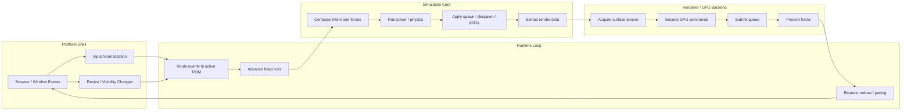
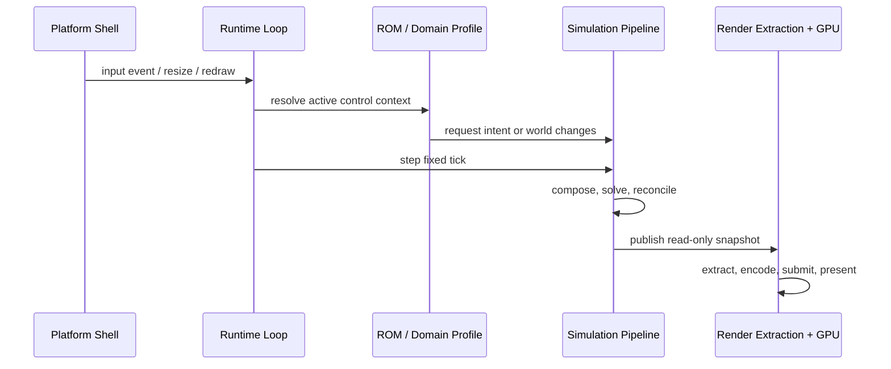
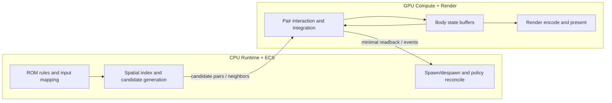

# Architecture

## System Overview
Anzu uses a layered runtime design so gameplay evolution and rendering can scale independently.

Core layers:
- Platform shell: Browser and window/canvas integration (winit + wasm-bindgen).
- Runtime loop: Owns frame ordering, fixed-tick orchestration, and lifecycle.
- Simulation pipeline: Composes intent, applies transforms, runs physics, and reconciles state in explicit stages.
- World state: Source of truth for gameplay state, transforms, and physics outcome.
- Render extraction: Converts simulation state into GPU-ready draw parameters.
- Renderer/GPU backend: Owns device resources and submits command buffers.

Contract:
- ROMs own input vocabulary and scenario rules.
- Browser/device input quirks are normalized before ROM mapping so ordinary ROMs bind to semantic controls instead of raw browser axis indices.
- Input context ownership is engine-first: `ControlPlaneState` owns the active ROM context stack and preempts it with an overlay context when any overlay is visible.
- `Escape` is reserved as the engine overlay anchor key and must not be bound by ROM control maps.
- Simulation composes applied intent first, then mutates world state through the physics pipeline.
- Physics updates are gameplay-state mutation (for example transforms, velocities, contact outcomes).
- Rendering reads state snapshots and must not contain gameplay business rules.
- Resource creation/destruction is centralized in renderer-owned lifecycle code.

## Core Glossary

- Simulation and visualization system: The engine core. It is domain-neutral and not game-specific.
- Domain profile: A concrete application of the core system (games are one profile).
- Entity: Stable identity that links state across simulation, rendering, and tooling.
- State: Time-varying data owned by simulation systems.
- Physics mesh: Canonical local-space collision geometry used for collision and mass-property construction.
- Solver: Deterministic numerical stage that advances simulation state per tick.
- Runtime pipeline: Ordered stages executed each frame/tick (input, compose, simulate, reconcile, extract, render).
- Render extraction: Read-only translation from simulation state into GPU-ready draw data.
- Adapter: Boundary layer that maps platform/runtime specifics into core abstractions.
- Resource handle: Stable ID referencing GPU/asset resources without embedding ownership in gameplay objects.

Terminology policy:
- Prefer domain-neutral terms (`simulation`, `visualization`, `domain profile`) in architecture and APIs.
- Treat game-specific words as profile-level vocabulary, not engine-core vocabulary.

Simulation flow:
1. Input adapters produce generic input events at the platform edge.
2. Browser input normalization translates raw controls into semantic controls where possible while preserving raw escape hatches for specialized hardware.
3. Runtime syncs the active ROM context from `ControlPlaneState` into the active `SimulationModel` before gameplay event dispatch and before each fixed update.
4. ROM simulation resolves inputs against the active context and may emit context transition requests (`Push`, `Pop`, `Replace`) back to the runtime.
5. Runtime applies requested context transitions to `ControlPlaneState`, then mirrors the resolved active context back into the simulation.
6. ROM simulation converts those events into intent and per-body applied forces.
7. World state is synchronized once per tick before physics.
8. Physics runs broadphase candidate selection, then narrowphase collision and impulse response.
9. ROM reconciliation handles policy-driven spawn/despawn and scenario-specific rules (including fragment replacement).
10. Rendering reads the final world snapshot and never writes gameplay state.

## Rendering Pipeline
Frame flow:
1. Platform receives redraw event.
2. Runtime accumulates fixed steps and executes the simulation pipeline.
3. Renderer acquires surface texture and encodes commands from the final world snapshot.
4. Renderer binds pipeline resources and submits draw calls.
5. Surface presents frame.

## Outer Loop and Inner Loop

Anzu works best when the runtime is split into two nested loops:

- Outer loop: platform and window events, ROM lifecycle, surface resize, input normalization, and redraw scheduling.
- Inner loop: deterministic simulation ticks that transform world state, emit gameplay effects, and produce renderable snapshots.

The key boundary is ownership. The platform shell can forward events, but it should not decide gameplay policy. The simulation can request changes to state, but it should not own the GPU surface. The renderer can own device resources and presentation, but it should read from simulation outputs instead of mutating gameplay state.

Practical reading order for the inner loop:

1. Input arrives at the platform edge.
2. The runtime maps that input into the active ROM context.
3. The simulation composes intent and per-body changes once per tick.
4. Physics and policy stages mutate simulation-owned world state.
5. Extraction converts the final snapshot into GPU-ready render data.
6. The renderer owns the surface, queue, and present path.

That flow matches the architecture contract: ROMs define scenario rules, simulation owns state mutation, render extraction stays read-only, and the renderer remains responsible for device-facing work.

Mutation rule of thumb:

- Simulation stages (`Compose`, `Sim`, `Reconcile`) are allowed to mutate gameplay state.
- Extraction and renderer stages are read-only over the published simulation snapshot.

## Hybrid CPU/GPU Simulation Contract

Anzu supports a hybrid simulation design where the CPU and GPU each own the work they handle best.

Ownership boundary:

- ECS/runtime owns entity lifecycle, gameplay policy, ROM rules, and deterministic stage ordering.
- CPU broadphase may own spatial indexing and candidate generation when this reduces transfer volume.
- GPU compute owns dense numeric work over packed buffers (force accumulation, pair evaluation, integration, constraint iterations).
- Renderer consumes the stabilized simulation snapshot and does not mutate gameplay state.

Why ECS remains required even with GPU simulation:

- ECS is the source of truth for identity, spawn/despawn, scenario tags, and policy transitions.
- Gameplay systems are heterogeneous and branch-heavy; they are not all good GPU kernels.
- Engine tooling needs ECS-level inspection, replay, save/load, and diagnostics.
- Backend variability (WebGPU/WebGL fallback behavior) requires stable runtime contracts above compute details.

Recommended data model for large body counts:

- Keep immutable/shared geometry in GPU-resident shape buffers keyed by `shape_id`.
- Keep dynamic body state in GPU-resident SoA-style buffers keyed by `body_id`.
- Send adjacency as contiguous arrays (`pair_list` or offset-indexed neighbor ranges), not pointer-heavy graph structures.
- Avoid hash-table-style vertex storage for rigid-body geometry; prefer contiguous ranges for cache/coalescing behavior.

Transfer policy in browser wasm:

- Prefer GPU-resident simulation state across frames.
- Prefer small command/event uploads and sparse readback instead of full-state roundtrips.
- Treat per-frame full upload plus full readback as a last resort for large simulations.
- Make transfer bytes a first-class metric in profiling and regression checks.

Current vertical slice target:
- ROM-owned entities with shared world physics.
- Spatial broadphase before SAT narrowphase collision checks.
- Material-driven render path with per-batch pipeline selection.
- One vertex buffer and one uniform bind group for transform data.
- Role-pair collision policy routing for solid-body vs hitbox outcomes.
- Bullet-triggered asteroid fragment replacement with independent child entities.
- Platformer locomotion slice with traction, crawl stance scaling, and grounded jump behavior.

Current rendering/material state:
- Entity mesh instances carry `material_id` values.
- Render extraction emits draw batches with material ranges.
- Renderer resolves material definitions from a registry with deterministic fallback.
- Pipeline selection is blend-aware (`Opaque`, `Alpha`, `Additive`) per draw batch.
- Per-material uniforms are bound via dynamic offsets for parameterized shading.
- Current shading model is PBR-lite (directional diffuse/specular + emissive), not full Disney BRDF.

Near-term rendering rules:
- Keep per-frame dynamic data in uniform buffers.
- Reuse pipeline and buffer objects across frames.
- Handle surface resize/lost/suboptimal events without panic.

## Resource Lifecycle
Lifecycle ownership:
- Initialization stage creates long-lived resources (pipeline, static buffers, bind group layouts).
- Frame stage updates transient data only (uniform writes, command encoder, render pass).
- Resize stage reconfigures surface-dependent resources.
- Shutdown stage allows window/event loop teardown without leaking resources.

Guidelines:
- Avoid resource re-creation in the hot path unless invalidated.
- Keep buffer usage flags minimal and explicit.
- Keep GPU state and simulation state represented as separate structs.

### Physics Mesh Residency Model

Definition:
- Physics mesh means local-space collision geometry used for collision queries and mass-property construction.
- Physics mesh is not per-frame world-space transformed vertices.

Buffer ownership:
- Keep one shared GPU shape buffer containing canonical local-space physics meshes.
- Each shape entry has stable shape metadata (vertex range, vertex count, optional edge range, and precomputed local mass properties).
- Bodies do not own vertex arrays; bodies own references to shape entries via `shape_id`.

Instantiation rule:
- Creating a new model instance that uses an existing physics mesh should create a new body state entry only.
- New body state stores transform, motion, material parameters, and mass overrides, but reuses the shared shape entry.
- Do not duplicate shape vertices per body unless deforming/destructible geometry requires unique topology.

When to copy mesh data:
- Copy only when the geometry itself changes (fracture, morph, procedural remesh, runtime authoring).
- If only transform or velocity changes, never copy shape vertices.
- If density/mass changes without topology changes, keep the same shape entry and update body mass properties from the same geometric source.

Construction-time mass properties:
- Build local-area/volume and inertia terms from the canonical local mesh once per shape.
- Cache these per-shape terms as read-only inputs; derive per-body inverse mass/inverse inertia from body density/mass policy.
- For static bodies, inverse mass and inverse inertia are zero while shape geometry remains shared.

Practical result:
- One geometry source drives both collision and construction-time inertia.
- Many bodies can reference one shape entry with independent dynamic state.
- Upload bandwidth stays low because per-frame updates touch body-state buffers, not shape-vertex buffers.

Residency and classification rules:
- Every runtime asset is classified as `critical`, `scaled_optional`, `reused`, or `streaming`.
- Runtime tracks residency state per handle (`Queued`, `Loading`, `Resident`, `EvictionPending`, `Evicted`).
- Quality fallback is mandatory for streamable visuals (fallback LOD/placeholder must exist).
- Eviction policy is class-specific and pressure-aware, not one global strategy.

Budget model:
- Budget hierarchy: `global` -> `cpu_wasm` and `gpu` -> per-class pools.
- Budget signals are dynamic and may change during a session.
- Pressure responses are staged: lower optional quality first, then evict non-critical content.
- Frame-critical logic must continue running when optional content is constrained.

Streaming subsystem:
- World content is partitioned into zones/cells with explicit dependencies.
- Cell activation is visibility-led with neighbor prefetch and unload hysteresis.
- Upload/stream work uses priority queues and bounded per-frame upload budgets.
- Renderer consumes resident handles only; streaming system drives transitions asynchronously.

## Performance Considerations
Runtime performance policy:
- Frame pacing: maintain stable pacing and avoid large dt spikes driving simulation instability.
- Allocation strategy: no avoidable heap allocations in per-frame hot path; reuse scratch buffers for tick-stage composition.
- Upload strategy: write only changed uniform/state data per frame.
- Batching: prefer fewer render passes and predictable state changes.
- Physics strategy: use spatial broadphase to minimize collision candidate pairs before SAT narrowphase.
- Composition strategy: compose forces and transforms once per tick, then apply to world objects in minimal passes.

Profiling gates:
- Establish baseline metrics before adding complex systems (auth, networking, compute offload).
- Require per-phase measurements for sync, composition, broadphase, narrowphase, reconcile, and render boundaries.
- Require measured bottlenecks before introducing compute pipelines.
- Keep fallback paths for browser backend variability (WebGPU/WebGL).

Future extension seams:
- Asset loading should produce content specs that instantiate ROM-facing world entities and simulation state.
- Simulation should accept ROM-defined intent/physics metadata rather than hardcoded game-specific rules.
- Networking should operate through transport abstractions and snapshot policies.
- Security should enforce deny-by-default and per-request authorization checks in server-facing components.

## Asset Ingestion Path

Target path:
1. `data-loader` reads source assets (`.glb` or `.obj` + `.mtl` + textures).
2. `asset-provider` canonicalizes and registers runtime asset records.
3. Runtime modules request model data from `asset-provider` by stable handles.
4. Physics creates `BodyState` from registered physics mesh handles, not from raw file streams.

Format-specific responsibility split:
- `data-loader` owns source decoding and format details.
- `asset-provider` owns canonical runtime representation and handle stability.
- Physics owns solver-side construction from canonical physics mesh records.

Canonicalization contract:
- Source formats are transport; runtime types are canonical.
- Imported mesh data is split into:
	- display mesh data (render-facing topology and material bindings), and
	- physics mesh data (local-space collision geometry and construction-time mass properties).
- Node/object transforms are applied during import canonicalization so physics mesh records remain stable local-space inputs.
- Textures/material data are optional for physics registration and must not block physics mesh registration.

Registration contract:
- `asset-provider` registers and indexes:
	- `display mesh handle`
	- `physics mesh handle`
	- `material handle`
	- `texture handle`
- Handle reuse is required for duplicate geometry/material content.
- `BodyState` stores physics mesh identity (shape id / physics mesh handle), while body motion/force/mass overrides stay body-local.

Failure policy:
- If display material/texture loading fails but physics mesh canonicalization succeeds, physics registration may continue with typed warnings.
- If physics mesh canonicalization fails, `BodyState` construction from that asset is denied with typed errors.
